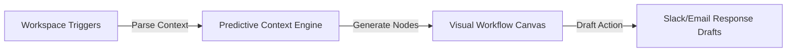

# 🧠 Neurlo — AI That Thinks Before You Ask

<div align="center">
  <a href="https://neurlo.tech" target="_blank">
    
  </a>
  
  
  
  
</div>

<br />

Neurlo is a next-generation AI operating system designed to automate professional workflows. It aggregates workspace contexts to draft actions, send updates, and coordinate workflows inside a single visual interface.

---

> ### 🔒 Security & Intellectual Property Note
> This public repository showcases Neurlo's frontend architecture, state engines, and canvas UI models. **To protect proprietary contextual parsing algorithms, agent routing engines, and API keys, the live backend system operates in a private repository.** The React components, visual layout pipelines, and page routing layouts are shared here.

---

## ✨ Features & UI Capabilities

*   **🔮 Predictive Context Panel**
    *   Surfaces relevant files and messages based on active user context and triggers.
*   **⚡ Drag-and-Drop Workflow Canvas**
    *   Interactive visual nodes mapping user workflows to automated execution steps.
*   **🛠️ Modern Design Architecture**
    *   Constructed from accessible, styled Shadcn UI components.
    *   Ensures responsive layouts and complete keyboard accessibility.

---

## 🛠️ Tech Stack & Design System

| Layer | Component | Implementation Detail |
| :--- | :--- | :--- |
| **Framework** | Next.js 14 (App Router) | Handles high-performance server rendering and API routes. |
| **Component Kit** | Radix UI + Shadcn | Accessibile components providing a modern visual experience. |
| **Design System** | Tailwind CSS | Clean, utility-first layout styling. |

---

## 📐 Context Workflow Architecture



---

## ⚙️ Running Locally (Frontend Only)

1. Install dependencies:
   ```bash
   npm install
   ```
2. Start the dev server:
   ```bash
   npm run dev
   ```
